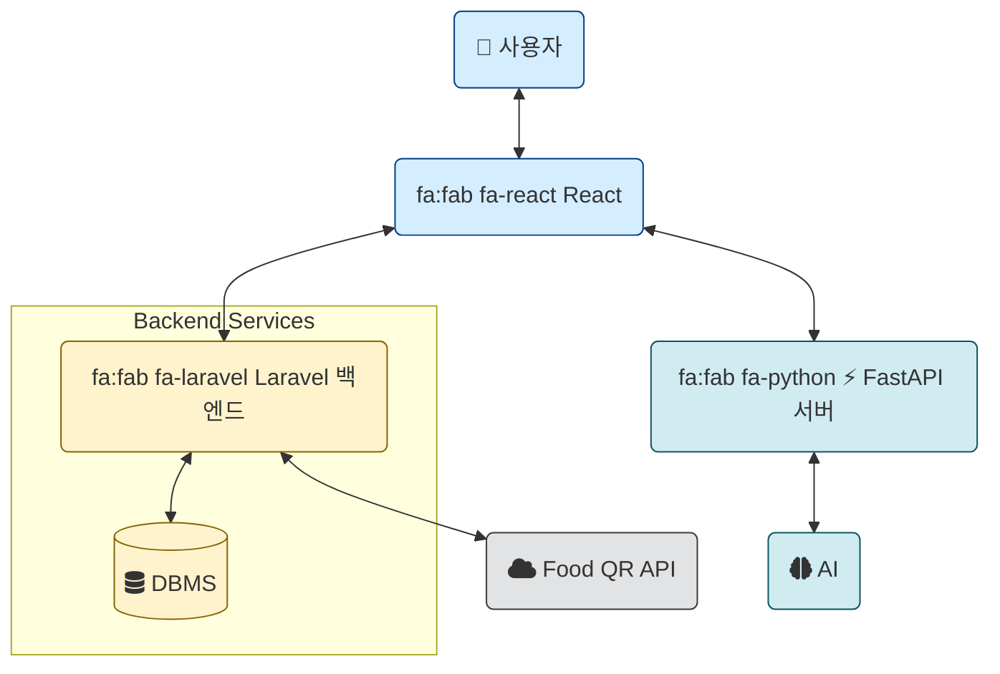

```mermaid
flowchart TD
    User("👤 사용자") <--> React("fa:fab fa-react React")
    React <--> Laravel("fa:fab fa-laravel Laravel 백엔드")
    React <--> FastAPI("fa:fab fa-python ⚡ FastAPI 서버")

    subgraph "Backend Services"
        direction LR
        Laravel <--> DB[("fa:fa-database DBMS")]
    end
        Laravel <--> FoodAPI("fa:fa-cloud Food QR API")
        FastAPI <--> PredictionModel("fa:fa-brain AI")

    style User fill:#d4edff,stroke:#004085
    style React fill:#d4edff,stroke:#004085
    style FastAPI fill:#d1ecf1,stroke:#0c5460
    style PredictionModel fill:#d1ecf1,stroke:#0c5460
    style FoodAPI fill:#e2e3e5,stroke:#383d41
    style Laravel fill:#fff3cd,stroke:#856404
    style DB fill:#fff3cd,stroke:#856404
```
